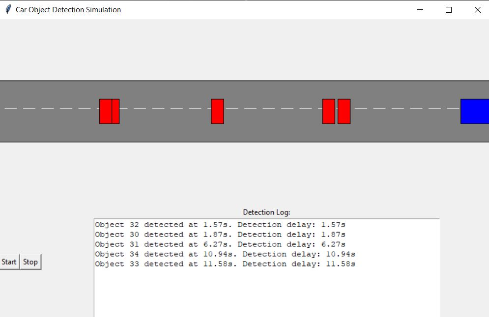

# ZeroCar Simulation with Object Detection

## Overview
This repo contains a Python-based car simulation that utilizes the Tkinter library to create a graphical user interface (GUI). The simulation features a car moving along a road and detecting objects placed at random intervals. The primary focus is to demonstrate object detection by a moving car and logging the detection time as well as the duration it took to detect each object.



### Object Placement and Detection
Objects are represented by oval shapes placed at random intervals along the road. The car detects these objects when it moves past them. Detection is determined by the overlapping coordinates of the car and objects.

### Detection Time
Detection time is recorded as the time elapsed from when the car starts moving until an object is detected. This is calculated using Python's `time.time()` function, which returns the current time in seconds since the epoch.

### Duration for Detection
The duration for detection refers to the time taken for the car to detect an object once it is within the detection range. This is a subset of the overall detection time and provides insight into the responsiveness of the detection algorithm.

## Implementation Details

### Starting the Simulation
The simulation begins when the user clicks the 'Start' button. This triggers the `start_simulation` function, which initializes the car's movement and begins the process of object detection.

#### Code Snippet: Starting the Simulation
```python
def start_simulation():
    global running
    running = True
    move_car()
    root.after(100, check_detection)
```
#### Object Detection Logic
The detection logic calculates the distance between the car and the nearest object. If this distance falls below a certain threshold, it is considered that the object has been detected.

Code Snippet: Object Detection
```python
def check_detection():
    global detection_start_time
    car_coords = canvas.coords(car)
    for obj in objects:
        obj_coords = canvas.coords(obj)
        if detect_collision(car_coords, obj_coords):
            detection_time = time.time() - detection_start_time
            log_detection(detection_time)
            break
    if running:
        root.after(100, check_detection)
```
#### Logging the Detection
When an object is detected, the event is logged in the 'Detection Log' area of the GUI. The log includes the detection time and the duration to detect.

Code Snippet: Logging the Detection
```python
def log_detection(detection_time):
    detection_log.insert('end', f'Object Detected at: {detection_time:.2f}s\n')
    detection_log.see('end')
```
#### Stopping the Simulation
The simulation can be stopped by clicking the 'Stop' button, which sets the running flag to False, stopping the car's movement and detection checks.

Code Snippet: Stopping the Simulation
```python
def stop_simulation():
    global running
    running = False
```

